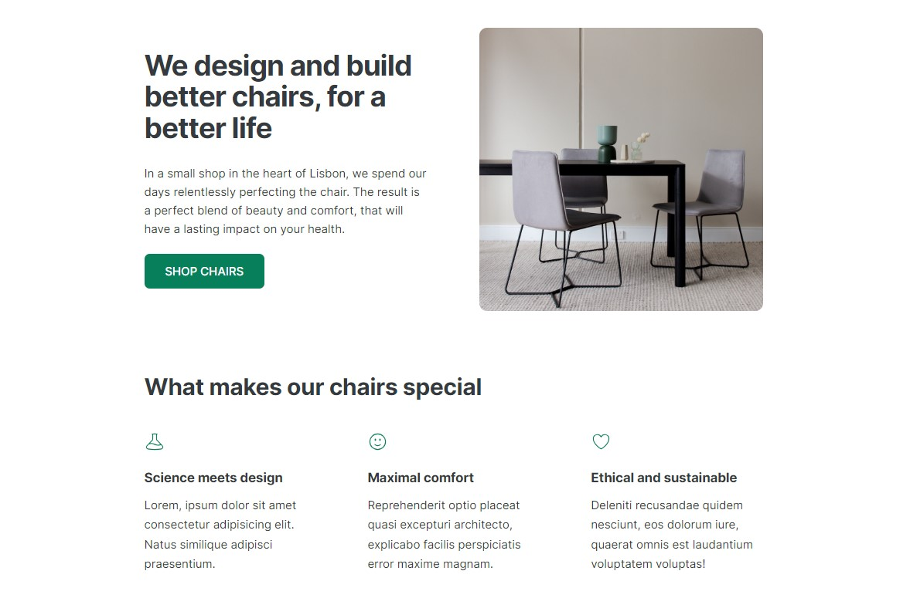
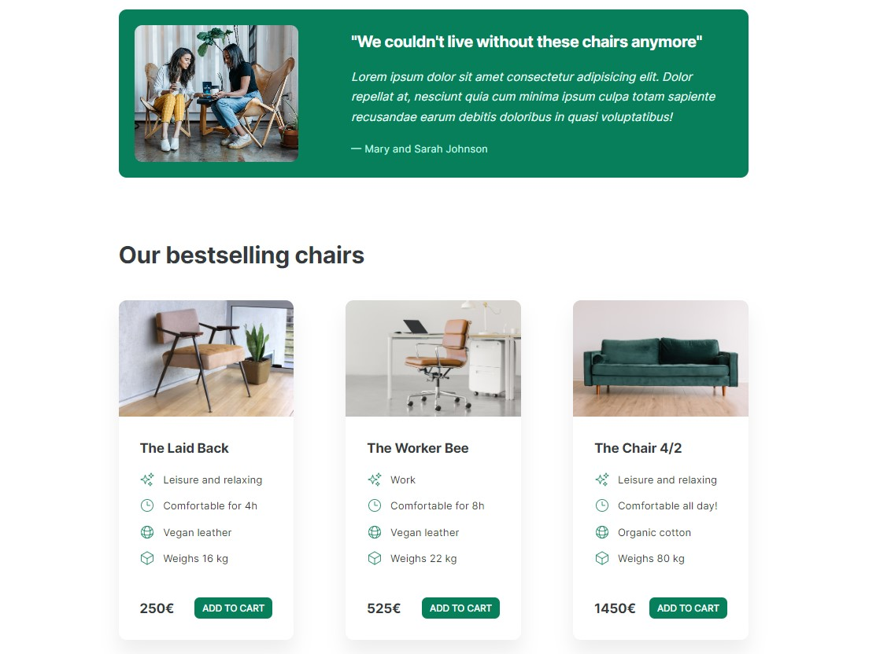
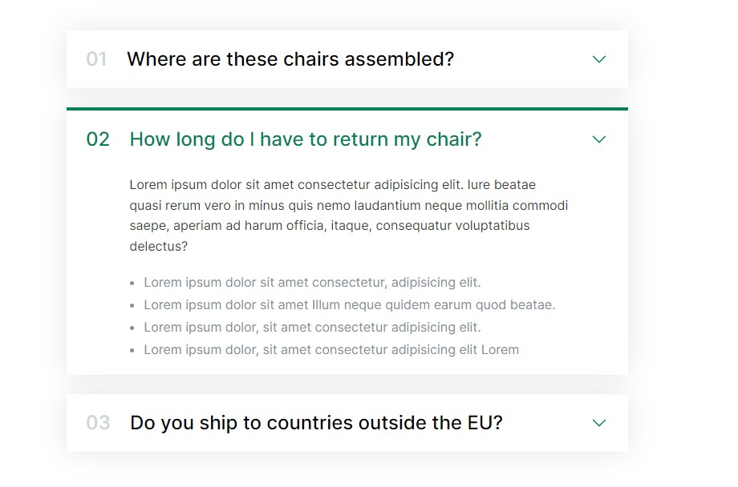
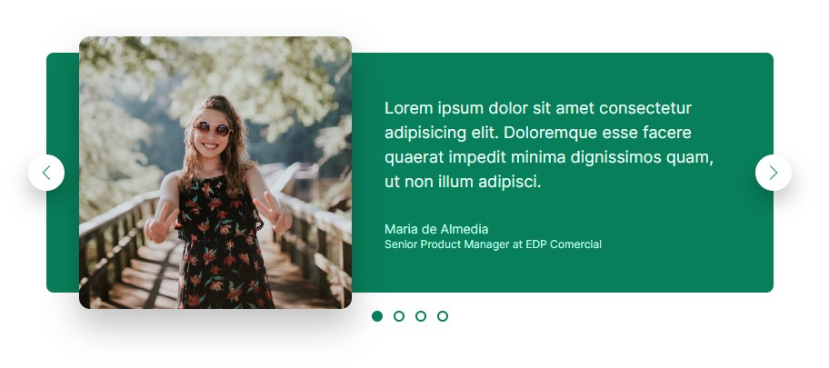
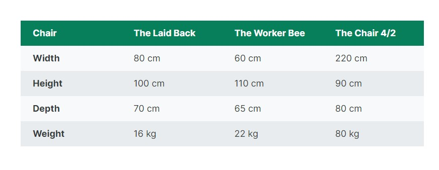
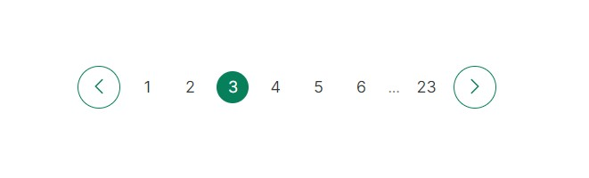
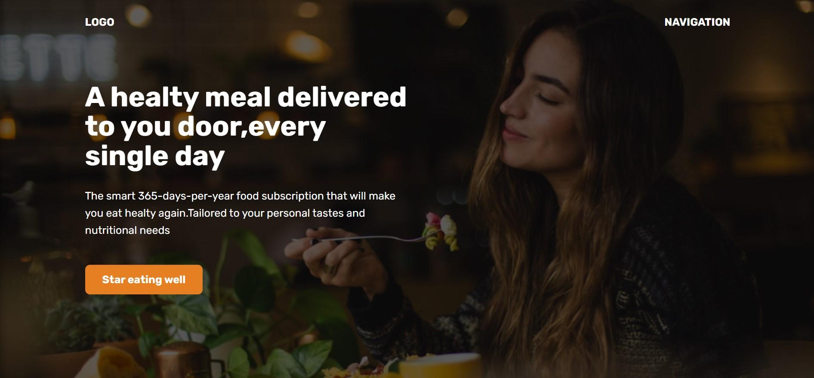
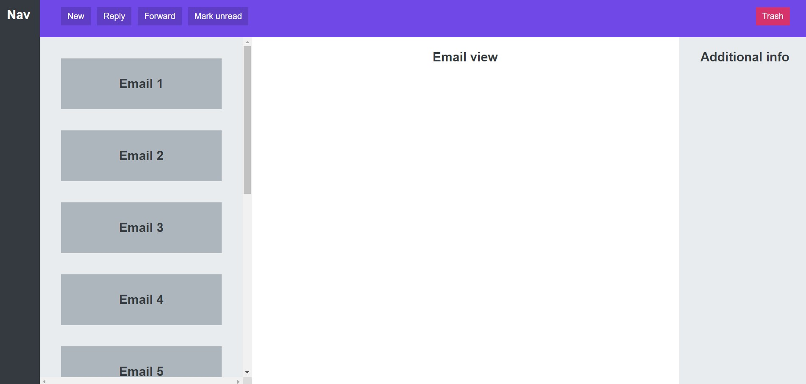

# Web design projects

### 1. WebDesign_1

Page layout, button shadowing, and icon usage design work has been completed. These changes enhance the user-friendliness and attractiveness of the website.

  
  

### 2. WebDesign_2

Work was done on the appearance of accordion tabs. These efforts resulted in a more appealing and user-friendly design for the tabs.

  

### 3. WebDesign_3

Carousel tab appearances were improved through design enhancements, creating a more visually appealing and user-friendly experience.

  

### 4. WebDesign_4

The table appearances were improved through design work.

  

### 5. WebDesign_5

Regarding pagination design efforts, changes were made to present the pages in a more organized and user-friendly manner.

  

### 6. WebDesign_6

In this project, I worked on page layout, background image overlays, and the working principle of VH. I made design improvements related to page layout, background images, and VH usage.

  

### 7. WebDesign_7

Page layout and scroll enhancements were made to improve the user experience.

  

